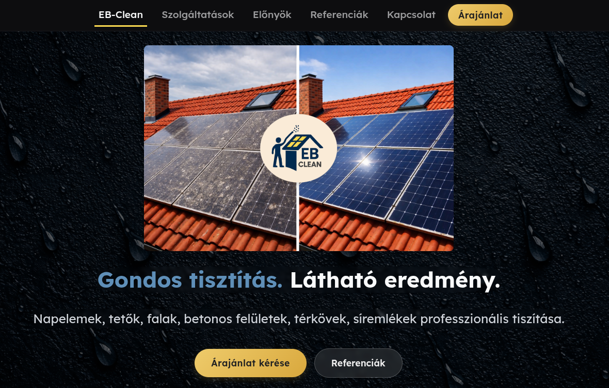

# EB-Clean Website

This repository contains the source code and deployment configuration for the **EB-Clean** website, a professional cleaning services landing page built with modern web technologies and deployed on AWS.

---


## Table of Contents

- [Overview](#overview)  
- [Features](#features)  
- [Technology Stack](#technology-stack)  
- [Architecture](#architecture)  


---

## Overview

**EB-Clean** is a professional cleaning service website that showcases services like:

- Solar panel cleaning
- Roof cleaning
- Wall cleaning
- Concrete surfaces cleaning
- Paving cleaning
- Gravestone cleaning  

It provides users with:

- Service descriptions
- Benefits overview
- Before/after references
- Contact and quote request form  

---

## Features

- Fully responsive landing page with Angular 21  
- Interactive “Before/After” image comparison slider  
- Contact form with reCAPTCHA verification  
- Automated email notifications via AWS SES  
- REST API integration with AWS Lambda + API Gateway  
- Secure hosting and CDN with AWS S3 and CloudFront  

---

## Technology Stack

- **Frontend:** Angular 21, TypeScript, SCSS  
- **Hosting:** AWS S3 (static hosting)  
- **CDN:** AWS CloudFront  
- **API:** AWS Lambda functions exposed via API Gateway (REST)  
- **Email:** AWS Simple Email Service (SES) for contact form submissions  
- **DNS & Domain:** Custom domain with MX records for business mailbox  
- **Security:** Google reCAPTCHA v3 integration for form validation  

---

## Architecture

```text
[User] 
   │
   ▼
[Angular Frontend] -- HTTPS --> [CloudFront CDN] -- Caching --> [S3 Bucket Hosting]
   │
   └─> [REST API via API Gateway] --> [AWS Lambda Functions] --> [SES for Emails]
